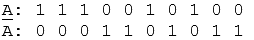
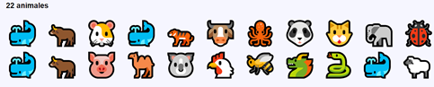
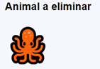
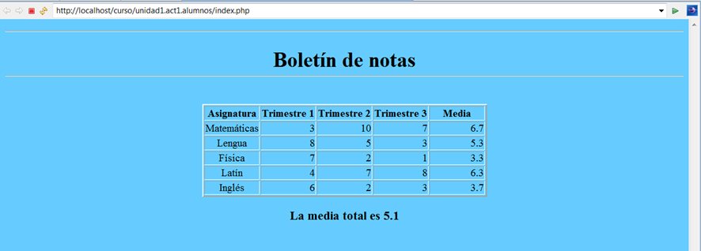

1. Escribe un script que almacene un array de 8 números enteros:

a.      recorrerá el array y lo mostrará

b.       lo ordenará y lo mostrará

c.       mostrará su longitud

d.       buscará un elemento dentro del array

e.      buscará un elemento dentro del array, pero por el parámetro que llegue a la URL

Para mostrar los elementos del array en cada uno de los apartados se creará una función llamada mostrarArray().

2. Crea un script que añada valores a un array mientras que su longitud sea menor que 120.

Después mostrará la información del array por pantalla

3. Escribe un script que rellene un array con valores aleatorios (0,1) y lo muestre. A continuación, calcularemos su complementario y también la mostraremos.
Por ejemplo:

4. Escriba un script PHP que:

Guarde en un array 20 valores aleatorios entre 0 y 100.
En un segundo array, llamado cuadrados, deberá almacenar los cuadrados de los valores que hay en el primer array.
En un tercer array, llamado cubo, se deben almacenar los cubos de los valores que hay en el primer array.
Por último, se mostrará el contenido de los tres arrays dispuesto en tres columnas paralelas.

5. Escriba un programa que:

Muestre un grupo de entre 20 y 30 animales al azar.
 Se usará un array para almacenar el código de los animales. El número de elementos del array será el determinado aleatoriamente entre 20 y 30. Tenga en cuenta que los animales son caracteres con rango Unicode: 128000 a 128060.Por ejemplo, podría mostrar el siguiente resultado:

A continuación, mostrará un animal al azar de los que están incluidos en el grupo anterior y lo eliminará del array. Por ejemplo:

                 
Por último, mostrará de nuevo el grupo inicial, pero habiendo eliminado del grupo los animales que coincidan con el animal suelto (al menos habrá uno). También mostrará un mensaje con el número total de animales que quedan.  En el ejemplo anterior quedarían 21 animales. 
Notas:

 uso de las funciones  rand(), array_rand(), unset.
Crea las funciones que consideres oportunas.

6. Escriba un script que cree un array con 15 números aleatorios y los muestre en pantalla. 

A continuación, rotará los elementos de ese array una posición. Es decir, el elemento de la posición 0 debe pasar a la posición 1, el de al 1 a la 2, …, el elemento de la última posición pasará a la posición 0. 

Por último, mostrará el nuevo contenido del array.

7. Usar foreach para mostrar todos los valores del array $_SERVER en una tabla con dos columnas. 

La primera columna debe contener el nombre de la variable, y la segunda su valor

8. Supongamos que guardamos en una array los datos de los profesores de este centro educativo.

Cada elemento de este array a su vez será otro array asociativo que nos permitirá almacenar su número de registro personal, su nombre, su apellido/s, su teléfono, y su fecha de nacimiento.

Se desea:

a) Crear un array con al menos los datos de 3 profesores

b) Crear una función que nos permita mostrar el número de registro personal de cada uno de los profesores

c) Modifica la función anterior y conviértela en una función anónima (usa array_map()).

d) Crea una función anónima que nos permita mostrar los profesores que han nacido a partir de 1990. ( Usa strtotime() y array_filter()

NOTA: Ejemplo de uso de funciones anónimas , arrays , array_map() y array_filter().

9. Escribe un programa que guarde en un array los nombres de las provincias de Andalucia.

 Usa la función unset() para borrar el elemento que desees de ese array. Deberás pasarle a la función como parámetro el índice del elemento a borrar. 

Por ejemplo, puedes borrar la de índice 2. Nota: Si no pones el índice en la función unset() se borrarán todos los elementos del array

10. Crea un array asociativo (o diccionario) con el censo de población de: España, Portugal, Francia, Italia y Grecia. 

11. Guarda en un array tus 10 películas favoritas.
Imprime en párrafos con el siguiente formato que incluye la posición de la película: ‘Película 4: Los Vengadores’
Vuelve a mostrar las películas pero en lugar de párrafos usa una tabla.
Añade un poco de CSS para mejorar el diseño. Cada título debe tener un color aleatorio. 

12. Utiliza arrays y funciones para escribir el código fuente, en lenguaje PHP, que presente en el navegador del cliente esta página: 

13. Para realizar el siguiente ejercicio nos basaremos en un juego de cartas de la baraja española llamado Brisca.

 a)    Reparte tres cartas a un jugador.

 Asegúrate de que no se repite ninguna carta, igual que si la hubieras cogido de una baraja real.
 Muestra las cartas que ha recibido el jugador. Se adjunta una carpeta con imágenes de cartas para que puedas usarlas en la presentación.
 b)    Supongamos que la partida ha finalizado y el jugador quiere saber los puntos que tiene en su baza. Para realizar este ejercicio supondremos que el jugador tiene 10 cartas en su baza

Muestra las cartas de la baza de este jugador ( tienes que extraerlas al azar de la baraja y verificar que no están repetidas)
Utiliza un array asociativo para obtener los puntos a partir del nombre de la figura de la carta.
Suma los puntos de cada una de las cartas de su baza.
Muestra el resultado
 Recomendaciones:

Usa un array para guardar los palos de la baraja.
Utiliza un array para guardar los nombres de las cartas: Sota, Caballo, As,…